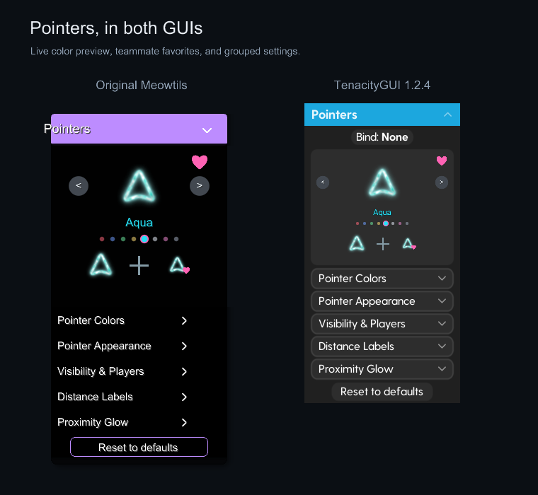
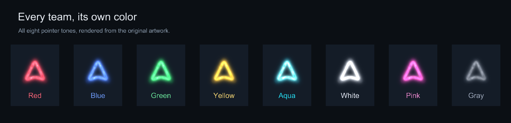
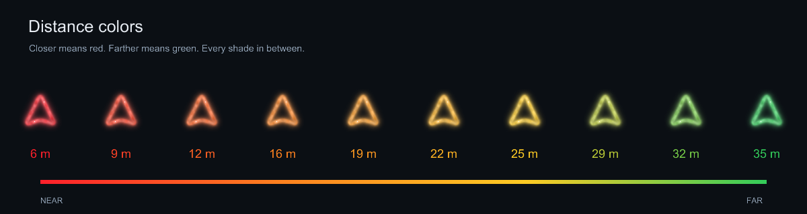
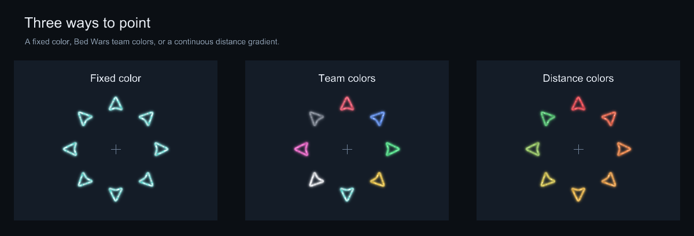
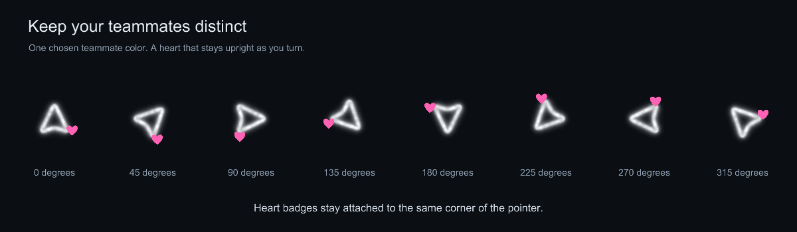

# Pointers

Pointers for Meowtils, with team colors, distance colors, and teammate heart markers.

Creator: **@futyimoso**. Made with the help of **GPT-6.1 Sol Ultra**.



## Download and install

[Download the latest release](https://github.com/meowflags/meowtils-pointers/releases/latest).

Requires **Minecraft 1.8.9, Forge, and Meowtils**. Tested with Meowtils 2.0.1.

1. Close Minecraft.
2. Put `PointersExtension-1.29.meowtils` in your instance's `minecraft/meowtils/extensions` folder.
3. If you use TenacityGUI, put the included `TenacityGUI-1.2.4.meowtils` there too.
4. Remove older Pointers and TenacityGUI files from that folder, then restart Minecraft.

With the original Meowtils GUI, you only need the Pointers file. No separate pointer textures or fonts are needed.

**TenacityGUI users:** the original, unmodified TenacityGUI does not display the custom live preview, color arrows, or heart controls. The included compatibility version adds support for them. Its other GUI functionality is retained.

The files in [`releases/`](releases/) are also available directly if you prefer downloading them from the repository.

## Features

- **Fixed color:** use one color for all opponents.
- **Team colors:** match opponents to their Bed Wars team colors, with a chosen fallback color.
- **Distance colors:** a smooth red, orange, yellow, and green gradient. Set the near and far thresholds; the published defaults are 6 m and 35 m.
- **Teammate hearts:** heart a preview color to use it for teammates. Their pointers get a small heart badge that stays upright while its position rotates with the pointer. Click the selected heart again to clear it.
- **Live preview:** cycle colors with the arrows, preview distances, and see teammate favorites. The button heart and preview badge animate when toggled.
- **Appearance and visibility:** size by distance, crosshair spacing, distance labels, NPC and teammate filters, lobby suppression, and a separate distance cutoff.
- **Proximity glow:** repeating or one-shot glow, automatically disabled while Distance colors is selected.

Selecting a teammate color turns off Hide Teammates. The extension includes the creator's published defaults for first-time users; existing saved settings are retained.

## Pictures









These showcase images use the actual Pointers 1.29 renderer. The GUI picture uses the original Meowtils GUI and the included TenacityGUI 1.2.4 compatibility version.

## Source and building

- [`src/pointers/`](src/pointers/): all Pointers Java source.
- [`resources/pointers/`](resources/pointers/): pointer artwork, font, extension metadata, and published defaults.
- [`src/tenacity-compat/`](src/tenacity-compat/): the five changed TenacityGUI classes, including optional preview hooks and custom setting support.
- [`tools/build.py`](tools/build.py): compile and package both extensions.

Building requires Python 3, JDK 17 or newer, and the Meowtils and Minecraft/Forge 1.8.9 development libraries on your classpath. The Minecraft library must use the SRG names referenced by the source. Those external development libraries are not bundled here.

```powershell
python tools/build.py --classpath-file path/to/classpath.txt
```

The classpath file contains one platform-specific Java classpath string. Alternatively, pass `--classpath` directly. Output goes to `build/dist/`.

For TenacityGUI, the build uses the included compatibility release as the unchanged base and recompiles its changed classes. To use the original TenacityGUI 1.2 instead, pass `--tenacity-base path/to/TenacityGUI-1.2.meowtils`.

The source was compiled for Java 8 compatibility. The module, color policy, teammate recognition, animation, default settings, and both GUI renderers were checked locally. The original TenacityGUI fallback was also rendered separately to confirm the compatibility requirement.

## Credits

Pointers builds on the original Pointers extension supplied for this project. TenacityGUI 1.2.4 is a compatibility modification of the original TenacityGUI 1.2 extension. Original code and bundled artwork/font remain credited to their respective creators; this repository does not claim authorship of those original components. See [PROVENANCE.md](PROVENANCE.md).

Please include the Meowtils version, GUI version, selected color mode, and a screenshot when reporting a problem.
